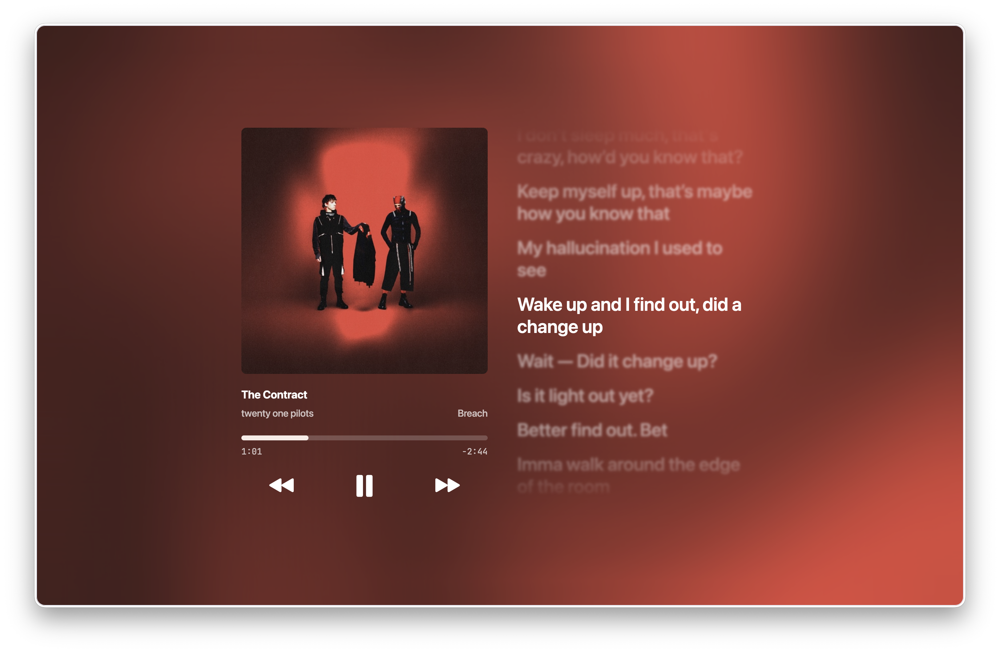

# music.localhost

Bun app that imitates the Apple Music fullscreen view on Macs using React, [mediaremote-adapter](https://github.com/ungive/mediaremote-adapter), and [LRCLIB](https://lrclib.net). Tiny WebSocket server and a (mostly vibeslopped) frontend.

I'll take PRs but would recommend you don't touch this codebase. It's hellish.

